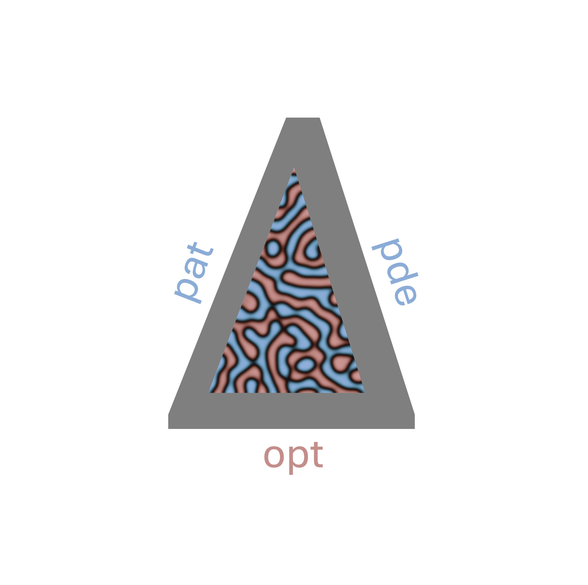

# pat-pde-opt
`pat-pde-opt` is a package for optimizing pattern forming PDEs that appear in different areas of physics, written in [JAX](https://github.com/jax-ml/jax). 
It has code for PDE optimization and control with gradient-based methods and reinforcement learning.
We use [diffrax](https://github.com/patrick-kidger/diffrax) for time stepping and implement system-specific solvers, such as semi-implicit Fourier methods and Strang splitting.

You can find the full documentation on [read the docs](https://pde-opt.readthedocs.io).

## Installation
To install the package, we recommend cloning the github repo and then installing locally:

```bash
git clone https://github.com/acoh64/pde-opt.git
cd pde-opt
conda create -y -n pde-opt-env python=3.10
conda activate pde-opt-env
pip install -e .
```

By default, it will install the CPU version of JAX.
To use with GPU, run:
```bash
pip install -U "jax[cuda12]"
```

## Usage

